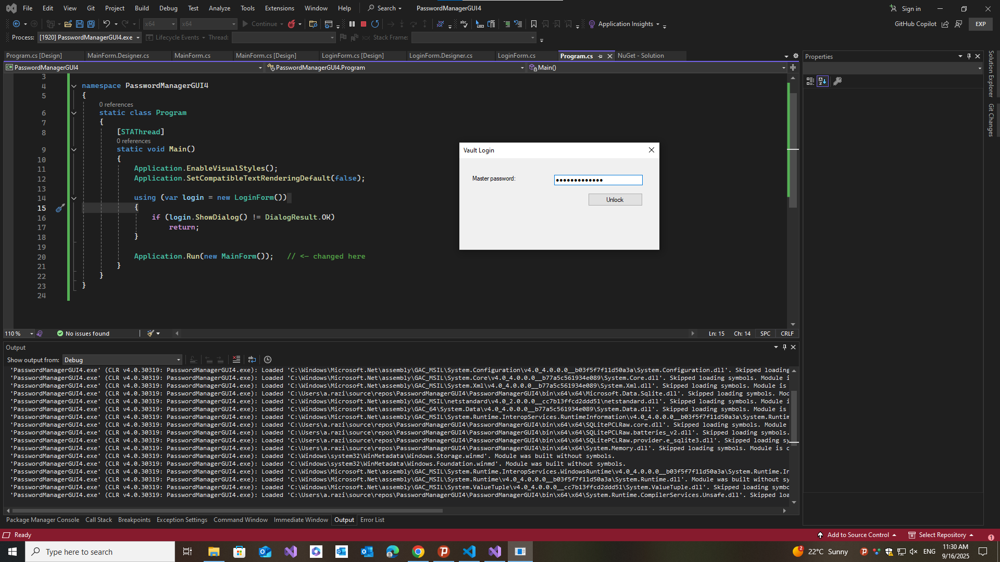

# 🔐 Password Manager GUI (Day Project)

A simple **C# Windows Forms Application** that demonstrates building a basic Password Manager GUI with login protection.  
This project is part of my **C# project-based learning journey**.

---

## 🚀 Features

- 🔑 **Login Form** before accessing the app  
- 🌐 Save website, username, and password  
- ❌ Delete entries  
- 👁 Reveal hidden password field  
- 🎨 Windows Forms–based GUI

---

## 📚 Learning Goals

- Understand how **partial classes** (`Form.cs` + `Form.Designer.cs`) work together  
- Learn to handle **event-driven programming** (`btnAdd_Click`, `btnDelete_Click`, etc.)  
- Practice using **WinForms controls**: labels, textboxes, buttons  
- Build a simple **multi-form workflow** (Login → Main Window)  
- Strengthen debugging skills when handling **common Visual Studio issues** (duplicates, missing `InitializeComponent`, etc.)

---

## 🖼️ Screenshots

### Login Form


---

## 🛠️ Tech Stack

- **Language:** C#  
- **Framework:** .NET Framework 4.7.2  
- **UI:** Windows Forms (WinForms)  
- **IDE:** Visual Studio  

---

## 📂 Project Structure

```bash
PasswordManagerGUI4/
│── Program.cs              # Entry point (runs LoginForm → MainForm)

│── LoginForm.cs            # Code-behind for login

│── LoginForm.Designer.cs   # Auto-generated designer for login UI

│── MainForm.cs             # Code-behind for password manager

│── MainForm.Designer.cs    # Auto-generated designer for manager UI

│── App.config              # App settings

│── packages.config         # NuGet dependencies (if any)

│── README.md               # Project documentation
